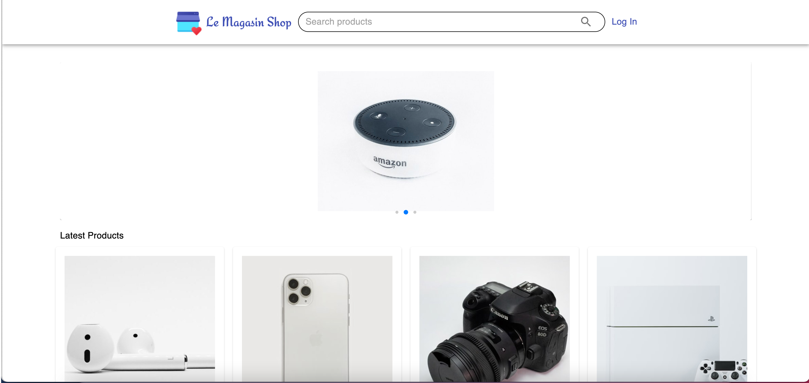
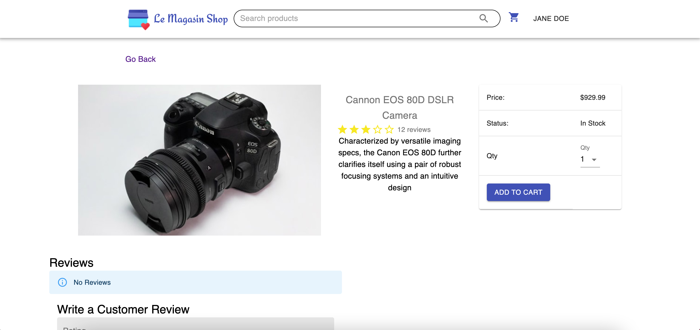

# Le Magasin Shop

## A fully-fledged MERN Stack application built from the ground up.

Le Magasin Shop is a basic yet functional E-Commerce app inspired by real world apps such as Amazon and Airbnb.

The goal for this project was to understand in more depth the MERN Stack and how each technology works together.

## Features Include:

- User Login/Registration
- User Authentication and Authorization
- Product Carousel
- Shopping Cart
- Custom Middleware for Authorization and Error Handling
- Multitude of CRUD actions for User, Product, and Order instances.
- Product Search Bar

## Technologies:

### Front End:

React, Redux, Material UI

### Back End:

Express, Mongoose, Node

### Database:

MongoDB

### 3rd Party APIs:

PayPal

### Other:

JWT authentication (JSON Web Tokens)

## Project Status:

Currently hosted on [Render](https://le-magasin-shop.onrender.com/)

Plans to add the following features:

- Mailer for password reset
- Ability to favorite products
- Further design work
